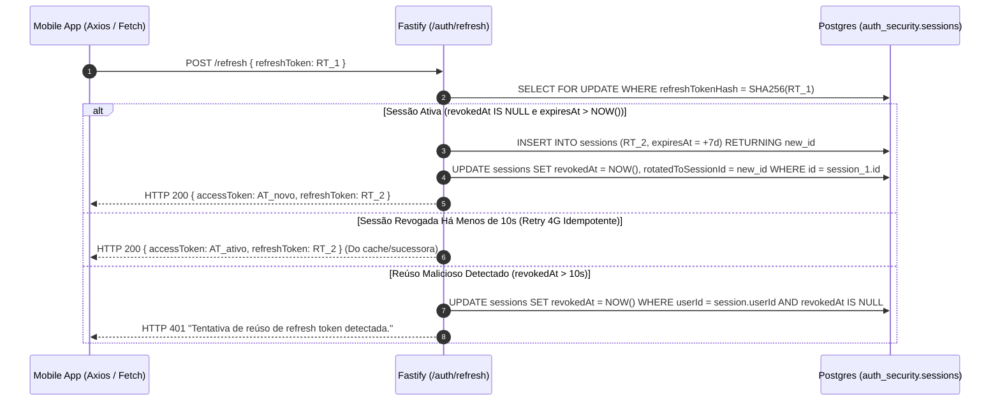

# 📘 Especificação Técnica e Funcional — Sprint 2: Autenticação 18+, Pseudonimato e Onboarding

- **Documento:** `specs/SPEC-SPRINT-02-AUTENTICACAO-E-ONBOARDING.md`
- **Projeto:** Jornada Firme (Âncora) — Ecossistema de Saúde Comunitária e Mútua Ajuda ([RFC 002](file:///home/thales/Projetos/Ancora/specs/RFC-002.md))
- **Status:** ✅ Concluída e Auditada
- **Sprint:** Sprint 2 (Fase 1 (A) — Autenticação Resiliente, Identidade Comunitária e Onboarding Móvel)
- **Autor/Arquitetura:** Engenharia Jornada Firme
- **Stack Tecnológica:** Node.js 22 LTS, TypeScript 5.7+ (Strict Mode), Fastify 5.2, PostgreSQL 16 Alpine, Drizzle ORM 0.45, `@fastify/jwt` 9.x, Argon2id (`argon2`), React Native 0.86, Expo 57, `expo-secure-store`, Zod 3.24

---

## 1. Visão Geral e Contexto de Identidade Anônima (RFC 002)

### 1.1. Princípio do Anonimato Persistente e Acolhedor

O ecossistema **Jornada Firme** nasceu fundamentado na premissa clínica e humana de que o estigma associado ao transtorno por uso de substâncias (TUS) é a maior barreira de entrada para a busca de ajuda. Inspirando-se na tradição central dos grupos de mútua ajuda — em particular a 12ª Tradição de **Narcóticos Anônimos (NA)**, que preconiza que _"o anonimato é o alicerce espiritual de todas as nossas tradições, lembrando-nos sempre de colocar os princípios acima das personalidades"_ —, a arquitetura da Sprint 2 consolida o conceito de **Identidade Comunitária Desacoplada**.

No modelo tradicional de aplicações web/mobile comerciais, o usuário é coagido a expor seu nome civil, e-mail institucional, foto de rosto e número de telefone celular. No Jornada Firme, essa abordagem é estritamente banida:

1. **Zero Exposição de Identificadores Pessoais (Zero-PII):** Nenhum membro da comunidade conhece o nome civil, endereço de e-mail, telefone ou IP de qualquer outro membro.
2. **Pseudônimo Neutro e Respeitoso:** Ao se cadastrar, o usuário recebe um pseudônimo poético e sereno gerado deterministicamente pelo sistema (ex: `@FarolSeguro_1042`), garantindo dignidade, horizontalidade radical e ausência de conotações pejorativas ou rótulos diagnósticos.
3. **Persistência Sem Rastreamento Vigilante:** O anonimato no Jornada Firme não equivale à volatilidade caótica de um fórum não-moderado. A identidade do usuário persiste de forma criptograficamente segura entre suas sessões, preservando seu histórico de vitórias e seus registros de check-in, sem que a plataforma precise vigiar sua vida privada.

```
+---------------------------------------------------------------------------------------------------+
|                                FLUXO CONCEITUAL DE IDENTIDADE ANÔNIMA                             |
+---------------------------------------------------------------------------------------------------+

   Usuário Anônimo                  Backend API (Fastify)                    PostgreSQL 16
         |                                    |                                    |
         |  1. Cadastro 18+ (Senha Forte)     |                                    |
         |----------------------------------->|                                    |
         |                                    |  2. Hashing Argon2id + Pepper      |
         |                                    |  3. Sorteio de @Pseudonimo_XXXX    |
         |                                    |  4. Geração de Chave Crockford     |
         |                                    |                                    |
         |                                    |  5. Transação Atômica ACID         |
         |                                    |----------------------------------->| auth_security.users
         |                                    |                                    | recovery_core.profiles
         |                                    |<-----------------------------------|
         |  6. Entrega de Chave Mestra e      |                                    |
         |     Par JWT (Access + Refresh)     |                                    |
         |<-----------------------------------|                                    |
         v                                    v                                    v
```

---

### 1.2. Trava Legal de Maioridade (18+): Mitigação Regulatória LGPD e ECA Digital

A dependência química e os registros de fissura, humor e recaída constituem **dados sensíveis de saúde** sob a égide do Artigo 5º, inciso II e Artigo 11 da **Lei Geral de Proteção de Dados (LGPD — Lei nº 13.709/2018)**.

Além disso, o tratamento de dados pessoais de crianças e adolescentes (Artigo 14 da LGPD e diretrizes do Estatuto da Criança e do Adolescente — ECA Digital) impõe exigências de consentimento específico de pais ou responsáveis legais por meio de verificação documental de filiação. A introdução de tal mecanismo de verificação civil destruiria categoricamente a premissa de anonimato e acolhimento imediato necessária para salvar vidas em momentos agudos de crise.

Por essa razão de integridade regulatória e médica:

- **Restrição Contratual Inegociável:** A plataforma é desenhada **exclusivamente para indivíduos com 18 anos completos ou mais**.
- **Trava Ativa no Cadastro:** O schema Zod (`registerBodySchema`) impõe `isAdult: z.literal(true)` e `healthDataConsent: z.literal(true)`. O usuário deve obrigatoriamente marcar as caixas de seleção atestando sua maioridade e consentindo com o tratamento exclusivo dos dados de saúde para acolhimento comunitário.
- **Armazenamento de Consentimento (Art. 11 LGPD):** Cada cadastro registra atomicamente na tabela `auth_security.consents` a versão vigente dos termos (`2026.1`), da política de privacidade (`2026.1`), o carimbo de data/hora UTC e a declaração explícita de maioridade.

---

### 1.3. O Conceito de Persona Dupla: Navegador vs. Ponto de Apoio

A comunidade Jornada Firme reconhece duas realidades complementares e fundamentais na jornada de sobriedade e recuperação:

| Persona                      | Definição Humana                                                                                           | Papel na Plataforma                                                                                            | Interface no Mobile                                                                               |
| :--------------------------- | :--------------------------------------------------------------------------------------------------------- | :------------------------------------------------------------------------------------------------------------- | :------------------------------------------------------------------------------------------------ |
| **Navegador** (`navegador`)  | Indivíduo que vivencia a recuperação ativa da dependência de álcool, drogas ou comportamentos compulsivos. | Realiza check-ins diários de humor e fissura, aciona o Semáforo SOS e trilha sua rotina saudável de superação. | Badges em tom esmeralda/teal, foco em ferramentas de contenção de fissura e autorreflexão.        |
| **Ponto de Apoio** (`apoio`) | Familiar, parceiro(a), amigo(a) ou companheiro(a) de grupo que atua como suporte solidário na rede.        | Oferece presença silenciosa, compartilha práticas de comunicação não-violenta e cuida de si mesmo(a).          | Badges em tom azul/slate, foco em orientações para evitar codependência e oferecer escuta segura. |

O vínculo de persona é persistido na coluna `recovery_core.profiles.persona` e injetado diretamente no payload dos tokens JWT (`persona: 'navegador' | 'apoio'`), adaptando dinamicamente a experiência do usuário sem comprometer a sua privacidade.

---

## 2. Detalhamento Técnico das Tarefas da Sprint 2

```
+---------------------------------------------------------------------------------------------------+
|                                  MAPA DE TAREFAS DA SPRINT 2                                      |
+---------------------------------------------------------------------------------------------------+

  [TASK-201: Registro 18+ & Argon2id] ────► [TASK-202: Pipeline JWT & Refresh Token Rotation]
                  │                                                     │
                  ▼                                                     ▼
  [TASK-203: Avatares Neutros & Quarentena] ◄───► [TASK-204: Suíte Mobile & SecureStore Fallback]
```

---

### TASK-201: Endpoint de Registro com Trava 18+ e Hashing Argon2id

#### 1. Escopo e Motivação

A [TASK-201](file:///home/thales/Projetos/Ancora/apps/api/src/routes/auth.ts) implementa o endpoint `POST /api/v1/auth/register`, estabelecendo a criação atômica da conta de acesso e do perfil comunitário. Toda a operação é governada por validações estritas em nível de schema Zod, hashing de credenciais com algoritmo de estado da arte recomendado pela OWASP (Argon2id) e geração determinística de chaves mestras e pseudônimos anônimos.

#### 2. Validação Contratual via Zod

O schema de entrada impõe a verificação literal da maioridade e do consentimento de saúde:

```typescript
// apps/api/src/routes/auth.ts
export const registerBodySchema = z.object({
  password: z
    .string()
    .min(8, 'A senha deve conter no mínimo 8 caracteres')
    .max(128, 'A senha deve conter no máximo 128 caracteres'),
  isAdult: z.literal(true, {
    errorMap: () => ({ message: 'É obrigatório ter 18 anos ou mais para utilizar a plataforma.' }),
  }),
  persona: z
    .enum(['navegador', 'apoio'], {
      errorMap: () => ({ message: "A persona deve ser 'navegador' ou 'apoio'." }),
    })
    .default('navegador'),
  termsVersion: z.literal('2026.1').default('2026.1'),
  privacyPolicyVersion: z.literal('2026.1').default('2026.1'),
  healthDataConsent: z.literal(true, {
    errorMap: () => ({
      message:
        'O consentimento explícito para tratamento de dados de saúde e suporte à recuperação é obrigatório.',
    }),
  }),
});
```

#### 3. Especificação Criptográfica do Argon2id e Injeção de Pepper

Para proteção contra ataques de força bruta offline acelerados por hardware dedicado (GPUs/ASICs), foi adotado o algoritmo **Argon2id** (variante híbrida recomendada pela OWASP, que combina a resistência do Argon2d contra ataques de canal lateral com a resistência do Argon2i contra ataques de preenchimento de memória).

- **Mecanismo:** Biblioteca nativa `argon2` compilada em C++ integrada ao Node.js.
- **Injeção de Pimenta Criptográfica (_Application Pepper_):** A senha do usuário é combinada a uma chave secreta de no mínimo 32 bytes (`APP_PEPPER_V1` ou `APP_PEPPER_SECRET`), injetada via variável de ambiente protegida e mantida exclusivamente na memória da aplicação (fora do banco de dados relacional). Se um atacante obtiver um dump completo do PostgreSQL, o cálculo das rainbow tables continuará sendo computacionalmente inviável.
- **Isolamento de CPU Fora do Pool de Conexões:** O cálculo do hash Argon2id (que consome aproximadamente 250ms de CPU intensiva e 64MB de RAM) é deliberadamente executado **antes** de se abrir a transação `db.transaction`. Isso impede a saturação (_starvation_) do pool de conexões do PostgreSQL durante picos de cadastro.

```typescript
// apps/api/src/lib/hash.ts
export async function hashPassword(password: string): Promise<string> {
  const pepper = env.APP_PEPPER_V1 || env.APP_PEPPER_SECRET;
  return argon2.hash(password, {
    type: argon2.argon2id,
    secret: Buffer.from(pepper),
  });
}

export async function verifyPassword(hash: string, password: string): Promise<boolean> {
  if (!hash) return false;
  const pepper = env.APP_PEPPER_V1 || env.APP_PEPPER_SECRET;
  try {
    return await argon2.verify(hash, password, {
      secret: Buffer.from(pepper),
    });
  } catch {
    return false;
  }
}
```

#### 4. Geração da Chave Mestra Crockford Base32

No modelo Zero-PII do Jornada Firme, como não há e-mail nem telefone armazenados, a recuperação de senha é assegurada por uma **Chave Mestra de Recuperação** emitida uma única vez no momento do cadastro.

- **Estrutura:** 20 caracteres extraídos do alfabeto `0123456789ABCDEFGHJKMNPQRSTVWXYZ` (Crockford Base32, excluindo as letras confusas `I`, `L`, `O` e a letra acidentalmente ofensiva `U`).
- **Formatação Canônica:** 4 blocos de 5 caracteres prefixados por `FIRME-` (ex: `FIRME-7K9XM-4P2QA-8VNZW-3TR1Y`).
- **Segurança no Armazenamento:** A chave em texto puro é entregue exclusivamente na resposta HTTP de cadastro para exibição na tela do dispositivo móvel. No banco de dados (`auth_security.users.recovery_key_hash`), armazena-se unicamente o hash SHA-256 da chave normalizada.

```typescript
// apps/api/src/lib/crypto-token.ts
export const CROCKFORD_BASE32_CHARSET = '0123456789ABCDEFGHJKMNPQRSTVWXYZ';

export function generateRecoveryKey(): string {
  let chars = '';
  for (let i = 0; i < 20; i++) {
    const randomIndex = crypto.randomInt(0, CROCKFORD_BASE32_CHARSET.length);
    chars += CROCKFORD_BASE32_CHARSET[randomIndex];
  }
  const b1 = chars.slice(0, 5),
    b2 = chars.slice(5, 10),
    b3 = chars.slice(10, 15),
    b4 = chars.slice(15, 20);
  return `FIRME-${b1}-${b2}-${b3}-${b4}`;
}
```

---

### TASK-202: Mecanismo JWT e Rotação de Refresh Token (RTR)

#### 1. Arquitetura do Par de Tokens

A autenticação do Jornada Firme adota uma arquitetura híbrida de tokens com responsabilidades estritamente separadas:

```
+---------------------------------------------------------------------------------------------------+
|                                 ARQUITETURA DO PAR DE TOKENS                                      |
+---------------------------------------------------------------------------------------------------+

   +───────────────────────────────────+             +───────────────────────────────────+
   |        ACCESS TOKEN (JWT)         |             |       REFRESH TOKEN (OPACO)       |
   +───────────────────────────────────+             +───────────────────────────────────+
   | - Tipo: Stateless (Criptográfico) |             | - Tipo: Stateful (Opaco em disco) |
   | - Algoritmo: HMAC-SHA256 (Fastify)|             | - Entropia: 32 bytes CSPRNG (Hex) |
   | - Validade: 15 minutos (Curta)    |             | - Validade: 7 dias                |
   | - Payload: sub, role, persona, tv |             | - Storage BD: Hash SHA-256 único  |
   | - Finalidade: Autorização em rotas|             | - Finalidade: Rotação de sessões  |
   +───────────────────────────────────+             +───────────────────────────────────+
```

1. **Access Token (Curta Duração — 15m):**
   - Assinado via `@fastify/jwt` com a chave `JWT_SECRET`.
   - Inspecionado em cada requisição privada pelo decorador `app.authenticate`.
   - Não consulta tabelas pesadas de perfil: os dados essenciais de autorização (`sub` = userId, `role`, `persona`, `tv` = tokenVersion) trafegam embutidos no token assinado.

2. **Refresh Token (Longa Duração — 7 dias com Rotação Atômica):**
   - Cadeia aleatória criptograficamente segura de 32 bytes gerada por `crypto.randomBytes(32).toString('hex')` (64 caracteres hexadecimais).
   - O token cru viaja exclusivamente para o dispositivo cliente e é persistido no `SecureStore`.
   - O banco de dados armazena unicamente o hash SHA-256 (`refreshTokenHash`), impossibilitando vazamento de sessões caso ocorra extração indevida do storage.

#### 2. Modelagem da Tabela `auth_security.sessions`

A tabela de sessões modela a linhagem e o ciclo de vida de cada token emitido:

```typescript
// apps/api/src/db/schema/auth.ts
export const sessions = authSchema.table(
  'sessions',
  {
    id: uuid('id').defaultRandom().primaryKey(),
    userId: uuid('user_id')
      .notNull()
      .references(() => users.id, { onDelete: 'cascade' }),
    refreshTokenHash: varchar('refresh_token_hash', { length: 255 }).notNull(),
    expiresAt: timestamp('expires_at', { withTimezone: true }).notNull(),
    revokedAt: timestamp('revoked_at', { withTimezone: true }),
    rotatedToSessionId: uuid('rotated_to_session_id'),
    createdAt: timestamp('created_at', { withTimezone: true }).defaultNow().notNull(),
  },
  (table) => [uniqueIndex('idx_sessions_refresh_token_hash').on(table.refreshTokenHash)],
);
```

#### 3. Algoritmo de Rotação de Refresh Token (RTR) e Detecção de Reúso Malicioso

O endpoint `POST /api/v1/auth/refresh` implementa a especificação completa de **Refresh Token Rotation (RTR)** conforme recomendado pela RFC 6749 e RFC 6819 do IETF (OAuth 2.0 Threat Model).

##### A. Princípio da Rotação

Sempre que um Refresh Token é consumido com sucesso para obter um novo par de tokens:

1. A sessão atual é marcada como revogada (`revokedAt = NOW()`).
2. Uma **nova sessão** é inserida com um novo par de tokens (`refreshTokenHash` inédito, validade estendida por mais 7 dias).
3. A sessão revogada recebe o apontador genealógico `rotatedToSessionId = novaSessao.id`.



##### B. Detecção de Reúso Malicioso e Invalidação em Cadeia (_Family Revocation_)

Se um invasor interceptar um refresh token que já foi rotacionado por um cliente legítimo e tentar utilizá-lo, o servidor intercepta a anomalia:

- **Condição:** `session.revokedAt !== null` e o tempo decorrido desde a revogação é superior à janela de tolerância de rede (`elapsedSeconds > 10`).
- **Ação Punitiva Imediata:** O sistema assume que a chave foi comprometida por um ataque de reprodução (_replay attack_). Executa-se uma instrução em lote invalidando **todas as sessões ativas do usuário** (`UPDATE auth_security.sessions SET revokedAt = NOW() WHERE userId = session.userId AND revokedAt IS NULL`).
- **Resposta:** Código HTTP 401 (`status: error`, `message: 'Tentativa de reúso de refresh token detectada.'`). O invasor e a vítima são deslogados compulsoriamente, forçando reautenticação manual via senha/chave.

##### C. Grace Period Idempotente de 10 Segundos contra Retries de Rede Móvel (4G/5G)

Em dispositivos móveis no Brasil, instabilidades de sinal frequentemente fazem com que a requisição de `/refresh` chegue ao servidor e seja processada, mas a resposta HTTP seja perdida no caminho devido a uma transição de antena celular. O aplicativo móvel reenvia a requisição original com o `RT_1` antigo.

Se o servidor simplesmente punisse essa segunda chamada como ataque, usuários legítimos seriam deslogados constantemente. Para solucionar isso sem abrir brechas de segurança:

1. **Janela de Graça:** Se `elapsedSeconds <= 10` e a sessão possui `rotatedToSessionId !== null`.
2. **Cache em Memória Idempotente:** Uma estrutura `recentRotations = new Map<string, CachedRotation>()` guarda os tokens emitidos durante 15 segundos. Se a requisição duplicada bater nessa janela, ela recebe exatamente o mesmo par de tokens sem revogar a conta.
3. **Limpeza Periódica:** Um temporizador `setInterval(cleanupRotations, 30 * 1000).unref()` expurga registros antigos da memória, evitando vazamento de RAM.

#### 4. Decorador Fastify `app.authenticate` e Validação de `tokenVersion`

A proteção de rotas privadas é executada pelo plugin registrado na raiz do servidor Fastify:

```typescript
// apps/api/src/server.ts
app.decorate('authenticate', async (request: FastifyRequest, reply: FastifyReply) => {
  try {
    await request.jwtVerify();
  } catch {
    return reply.status(401).send({
      status: 'error',
      message: 'Token de autenticação inválido ou expirado.',
    });
  }

  const [user] = await db
    .select({
      id: users.id,
      tokenVersion: users.tokenVersion,
    })
    .from(users)
    .where(eq(users.id, request.user.sub))
    .limit(1);

  if (!user || user.tokenVersion !== request.user.tv) {
    return reply.status(401).send({
      status: 'error',
      message: 'Sessão revogada ou conta inexistente.',
    });
  }
});
```

> [!IMPORTANT]
> **Revogação Instantânea Global via `tokenVersion`:** Quando uma conta é redefinida por chave mestra ou tem suas credenciais alteradas, o campo `users.token_version` é incrementado (`nextTokenVersion = tokenVersion + 1`). Qualquer Access Token emitido anteriormente — mesmo que ainda esteja dentro dos seus 15 minutos de validade matemática — é sumariamente rejeitado no próximo request pelo decorador `app.authenticate`.

---

### TASK-203: Catálogo de Avatares Neutros e Rotação de Identidade

#### 1. Filosofia Visual dos Avatares

Para evitar comparações estéticas, fotos hiper-realistas que permitam identificação civil ou imagens que provoquem gatilhos, o ecossistema disponibiliza um catálogo fechado de **8 avatares neutros e serenos**. Cada símbolo evoca acolhimento, orientação e estabilidade emocional:

| ID do Avatar        | Rótulo Descritivo      | Categoria | Significado Clínico/Simbólico                                     |
| :------------------ | :--------------------- | :-------- | :---------------------------------------------------------------- |
| `avatar_anchor`     | **Âncora (Firmeza)**   | Símbolo   | Firmeza interior para atravessar momentos turbulentos de fissura. |
| `avatar_lighthouse` | **Farol (Orientação)** | Símbolo   | Luz e direção em meio à escuridão da tempestade pessoal.          |
| `avatar_compass`    | **Bússola (Direção)**  | Símbolo   | O reencontro com o próprio rumo e valores vitais.                 |
| `avatar_wave`       | **Onda Serena**        | Natureza  | A aceitação das emoções passageiras (_urge surfing_).             |
| `avatar_breeze`     | **Brisa Leve**         | Natureza  | Serenidade, respiração pausada e alívio do peso diário.           |
| `avatar_mountain`   | **Montanha Firme**     | Natureza  | Resiliência sólida e permanência na sobriedade.                   |
| `avatar_tree`       | **Árvore Raiz**        | Natureza  | Crescimento sustentável com raízes firmes na comunidade.          |
| `avatar_sun`        | **Alvorecer**          | Natureza  | Um novo dia limpo, a renovação da esperança a cada 24 horas.      |

```typescript
// apps/api/src/lib/avatars.ts
export const AVAILABLE_AVATARS = [
  { id: 'avatar_anchor', label: 'Âncora (Firmeza)', category: 'symbol' },
  { id: 'avatar_lighthouse', label: 'Farol (Orientação)', category: 'symbol' },
  { id: 'avatar_compass', label: 'Bússola (Direção)', category: 'symbol' },
  { id: 'avatar_wave', label: 'Onda Serena', category: 'nature' },
  { id: 'avatar_breeze', label: 'Brisa Leve', category: 'nature' },
  { id: 'avatar_mountain', label: 'Montanha Firme', category: 'nature' },
  { id: 'avatar_tree', label: 'Árvore Raiz', category: 'nature' },
  { id: 'avatar_sun', label: 'Alvorecer', category: 'nature' },
] as const;
```

#### 2. Estrutura do Pseudônimo e Cálculo do Espaço Amostral

O pseudônimo comunitário segue rigorosamente o formato canônico:
$$\text{Pseudônimo} = \text{"@"} + \text{Substantivo} + \text{Qualificador} + \text{"\_"} + \text{Sufixo (1000 a 9999)}$$

- **Substantivos Poéticos (32 opções):** Caminho, Farol, Brisa, Passo, Porto, Horizonte, Vento, Abrigo, Refugio, Recanto, Aurora, Alvorada, Jardim, Bosque, Manancial, Oceano, Colina, Estrela, Planalto, Raio, Lua, Sol, Cais, Vale, Riacho, Semente, Arvore, Raiz, Claridade, Remanso, Ninho, Fonte.
- **Qualificadores Construtivos (26 opções):** Calmo, Seguro, Livre, Novo, Presente, Forte, Atento, Claro, Manso, Tranquilo, Brilhante, Suave, Pacifico, Radiante, Constante, Consciente, Generoso, Acolhedor, Lucido, Resiliente, Valente, Sincero, Justo, Vigilante, Sereno, Firme.
- **Sufixo Numérico:** Inteiro aleatório no intervalo uniforme $[1000, 9999]$ (9.000 slots numéricos).

$$\text{Espaço Amostral Total} = 32 \times 26 \times 9.000 = 7.488.000 \text{ pseudônimos únicos}$$

Com quase 7,5 milhões de combinações possíveis, a probabilidade de colisão em lote inicial é estatisticamente ínfima. O gerador tenta até 15 vezes (`maxAttempts = 15`) encontrar um identificador livre antes de abortar.

#### 3. Quarentena de Pseudônimos por 30 Dias e Rotação Atômica

Na rotação de pseudônimo (`POST /api/v1/profile/rotate-identity`), caso o membro da comunidade deseje reiniciar seu ciclo social sem carregar estigmas prévios:

1. O pseudônimo antigo é transferido imediatamente para a tabela `recovery_core.quarantined_pseudonyms` com expiração estipulada em `quarantinedUntil = NOW() + 30 dias`.
2. Isso impede que terceiros assumam o pseudônimo recém-abandonado para personificar o usuário perante outros membros.
3. O `login_token` em `auth_security.users` é recalculado atomicamente na mesma transação relacional para corresponder ao novo pseudônimo (`deriveLoginToken(newPseudonym)`).

```typescript
// Trecho de apps/api/src/routes/profile.ts
if (regeneratePseudonym) {
  newPseudonym = await generateAvailablePseudonym(tx);

  // 1. Quarentena preventiva de 30 dias
  const quarantinedUntil = new Date(Date.now() + 30 * 24 * 60 * 60 * 1000);
  await tx
    .insert(quarantinedPseudonyms)
    .values({ pseudonym: currentProfile.pseudonym, quarantinedUntil })
    .onConflictDoUpdate({
      target: quarantinedPseudonyms.pseudonym,
      set: { quarantinedUntil },
    });

  // 2. Atualização atômica do loginToken no banco de autenticação
  const newLoginToken = deriveLoginToken(newPseudonym);
  await tx
    .update(users)
    .set({ loginToken: newLoginToken, updatedAt: new Date() })
    .where(eq(users.id, userId));
}
```

---

### TASK-204: Suíte de Onboarding e Armazenamento Seguro no Mobile (Expo)

#### 1. Arquitetura das Telas de Onboarding no React Native

A camada cliente móvel (`apps/mobile`) oferece uma jornada sem atritos construída sobre React Native 0.86, Expo 57 e styling via React Native StyleSheet integrado aos temas Claro (_Off-white linho_) e Escuro (_Slate/Teal profundo_).

```
+───────────────────────────────────────────────────────────────────────────────────────────────────+
|                                    FLUXO DE NAVEGAÇÃO MOBILE                                      |
+───────────────────────────────────────────────────────────────────────────────────────────────────+

                                    [App.tsx (Raiz)]
                                           │
                        ┌──────────────────┴──────────────────┐
                        │ Verifica Sessão (storage.getItem)    │
                        ▼                                     ▼
                [Não Autenticado]                       [Autenticado]
                        │                                     │
           ┌────────────┴────────────┐                        ├─► justRegistered == true?
           ▼                         ▼                        │   └─► [IdentityRevealScreen]
    [WelcomeScreen]           [LoginScreen]                   │
           │                         ▲                        └─► justRegistered == false?
           ▼                         │                            └─► [HomeScreen]
    [RegisterScreen] ────────────────┘
   (Trava 18+ & LGPD)
```

1. **`WelcomeScreen` (Boas-Vindas):**
   - Apresentação da marca Jornada Firme e ícone âncora sereno.
   - Os 3 Pilares de Confiança: _"Sem e-mail e sem nome civil"_, _"No seu ritmo, sem cobrança"_ e _"SOS funciona mesmo sem internet"_.
   - Alternância fluida entre tema claro e escuro.
   - Encaminhamento direto para `RegisterScreen` (_Começar Jornada_) ou `LoginScreen` (_Entrar_).

2. **`RegisterScreen` (Cadastro com Trava Dupla):**
   - Seleção da trilha inicial via cards interativos: **Navegador** (compasso) ou **Ponto de Apoio** (aperto de mãos).
   - Validação de senha local com medidor de segurança (mínimo de 8 caracteres e confirmação visual).
   - **Trava Legal 18+:** Checkbox interativo com declaração de maioridade ativa.
   - **Consentimento Art. 11 LGPD:** Checkbox específico para tratamento estrito de dados de saúde.
   - Acesso ao modal informativo `TermsModal` com a íntegra das diretrizes v2026.1.

3. **`IdentityRevealScreen` (Revelação da Persona & Retenção da Chave Mestra):**
   - Apresentação do pseudônimo gerado pelo servidor (`@FarolSeguro_1042`) e do avatar inicial.
   - **Card de Alto Destaque da Chave Mestra:** Exibição da chave no formato canônico `FIRME-XXXXX-...`.
   - Botão _"Copiar Chave"_ com integração direta ao `expo-clipboard` e feedback tátil/visual.
   - Trava de confirmação mandante: o botão _"Começar"_ só é ativado se o usuário copiou a chave ou marcou a confirmação de que a salvou em local seguro.

4. **`LoginScreen` (Entrada Direta):**
   - Login limpo exigindo exclusivamente o Pseudônimo e a Senha secreta.
   - Acesso ao modal de recuperação com Chave Mestra (`RecoverAccountModal`).

5. **`HomeScreen` (Área Logada):**
   - Header exibindo avatar sereno, pseudônimo e badge da persona.
   - Cards de progresso cumulativo, check-in do dia e acesso ao Semáforo SOS.
   - Botão de logout seguro com limpeza atômica de chaves e dados em cache.

---

## 3. Catálogo de Arquivos Envolvidos e Responsabilidades

A tabela a seguir consolida a auditoria de 100% dos arquivos reais que sustentam a infraestrutura da Sprint 2:

| Workspace  | Caminho do Arquivo                                                                                                                         | Responsabilidade Técnica na Sprint 2                                                                           |
| :--------- | :----------------------------------------------------------------------------------------------------------------------------------------- | :------------------------------------------------------------------------------------------------------------- |
| **API**    | [`apps/api/src/env.ts`](file:///home/thales/Projetos/Ancora/apps/api/src/env.ts)                                                           | Validação via Zod das variáveis de autenticação: `JWT_SECRET`, `APP_PEPPER_SECRET` e `APP_PEPPER_V1`.          |
| **API**    | [`apps/api/src/server.ts`](file:///home/thales/Projetos/Ancora/apps/api/src/server.ts)                                                     | Registro de `@fastify/jwt`, decorador `app.authenticate`, configuração de Rate Limit e error handlers Zod.     |
| **API**    | [`apps/api/src/@types/fastify-jwt.d.ts`](file:///home/thales/Projetos/Ancora/apps/api/src/@types/fastify-jwt.d.ts)                         | Extensão estrita de tipos do Fastify JWT definindo payload (`sub`, `role`, `persona`, `tv`) e decorador.       |
| **API**    | [`apps/api/src/db/schema/auth.ts`](file:///home/thales/Projetos/Ancora/apps/api/src/db/schema/auth.ts)                                     | Tabelas `auth_security.users`, `auth_security.sessions` (RTR) e `auth_security.consents` (Art. 11 LGPD).       |
| **API**    | [`apps/api/src/db/schema/recovery.ts`](file:///home/thales/Projetos/Ancora/apps/api/src/db/schema/recovery.ts)                             | Tabelas `recovery_core.profiles` e `recovery_core.quarantined_pseudonyms` (30 dias).                           |
| **API**    | [`apps/api/src/lib/hash.ts`](file:///home/thales/Projetos/Ancora/apps/api/src/lib/hash.ts)                                                 | Hashing Argon2id com injeção de pepper secreto e inicialização de `dummyHash` anti-timing attack.              |
| **API**    | [`apps/api/src/lib/crypto-token.ts`](file:///home/thales/Projetos/Ancora/apps/api/src/lib/crypto-token.ts)                                 | Geração/normalização da Chave Mestra Crockford Base32 e derivação HMAC de `accountToken` e `loginToken`.       |
| **API**    | [`apps/api/src/lib/pseudonym.ts`](file:///home/thales/Projetos/Ancora/apps/api/src/lib/pseudonym.ts)                                       | Gerador de pseudônimos poéticos (32 substantivos $\times$ 26 adjetivos) com verificação de colisão/quarentena. |
| **API**    | [`apps/api/src/lib/avatars.ts`](file:///home/thales/Projetos/Ancora/apps/api/src/lib/avatars.ts)                                           | Catálogo e tipos dos 8 avatares neutros e funções de validação de catálogo.                                    |
| **API**    | [`apps/api/src/lib/rate-limit.ts`](file:///home/thales/Projetos/Ancora/apps/api/src/lib/rate-limit.ts)                                     | Balde de rate-limiting por conta (bloqueio de 15 minutos após 5 falhas consecutivas).                          |
| **API**    | [`apps/api/src/routes/auth.ts`](file:///home/thales/Projetos/Ancora/apps/api/src/routes/auth.ts)                                           | Endpoints de autenticação: `/register` (18+), `/login`, `/refresh` (RTR), `/logout`, `/me` e `/recover`.       |
| **API**    | [`apps/api/src/routes/profile.ts`](file:///home/thales/Projetos/Ancora/apps/api/src/routes/profile.ts)                                     | Endpoints de identidade comunitária: `GET /avatars`, `GET /me` e `POST /rotate-identity`.                      |
| **Mobile** | [`apps/mobile/App.tsx`](file:///home/thales/Projetos/Ancora/apps/mobile/App.tsx)                                                           | Navegação raiz orientada a estado de autenticação (`isLoading`, `isAuthenticated`, `justRegistered`).          |
| **Mobile** | [`apps/mobile/src/types/auth.ts`](file:///home/thales/Projetos/Ancora/apps/mobile/src/types/auth.ts)                                       | Tipagem TypeScript completa de modelos de usuário, perfil, sessão e respostas de API.                          |
| **Mobile** | [`apps/mobile/src/services/storage.ts`](file:///home/thales/Projetos/Ancora/apps/mobile/src/services/storage.ts)                           | Abstração de persistência segura com `expo-secure-store` e fallback para `localStorage` no browser/web.        |
| **Mobile** | [`apps/mobile/src/services/api.ts`](file:///home/thales/Projetos/Ancora/apps/mobile/src/services/api.ts)                                   | Cliente HTTP Fetch com timeout nativo (15s), interceptor silencioso de refresh token e mutex de concorrência.  |
| **Mobile** | [`apps/mobile/src/contexts/AuthContext.tsx`](file:///home/thales/Projetos/Ancora/apps/mobile/src/contexts/AuthContext.tsx)                 | Estado global de autenticação, restauração de sessão em boot, login, register, logout e retenção de chave.     |
| **Mobile** | [`apps/mobile/src/screens/WelcomeScreen.tsx`](file:///home/thales/Projetos/Ancora/apps/mobile/src/screens/WelcomeScreen.tsx)               | Tela de boas-vindas com silhueta de colinas, pontos de confiança serenos e seletor de tema.                    |
| **Mobile** | [`apps/mobile/src/screens/RegisterScreen.tsx`](file:///home/thales/Projetos/Ancora/apps/mobile/src/screens/RegisterScreen.tsx)             | Tela de cadastro com seletor de persona, senha forte, travas 18+ e consentimento LGPD.                         |
| **Mobile** | [`apps/mobile/src/screens/IdentityRevealScreen.tsx`](file:///home/thales/Projetos/Ancora/apps/mobile/src/screens/IdentityRevealScreen.tsx) | Tela de retenção obrigatória da Chave Mestra Crockford e apresentação do pseudônimo.                           |
| **Mobile** | [`apps/mobile/src/screens/LoginScreen.tsx`](file:///home/thales/Projetos/Ancora/apps/mobile/src/screens/LoginScreen.tsx)                   | Tela de login via pseudônimo e senha, com gatilho para recuperação por chave mestra.                           |
| **Mobile** | [`apps/mobile/src/screens/HomeScreen.tsx`](file:///home/thales/Projetos/Ancora/apps/mobile/src/screens/HomeScreen.tsx)                     | Tela inicial logada com resumo do perfil, progresso cumulativo, check-in e logout.                             |

---

## 4. Modelagem de Dados e Schemas Drizzle da Sprint 2

### 4.1. Schema `auth_security.users`

Armazena a entidade autenticável em conformidade estrita com Zero-PII. Não há qualquer coluna de e-mail, telefone, CPF ou nome civil.

```typescript
export const users = authSchema.table(
  'users',
  {
    id: uuid('id').defaultRandom().primaryKey(),
    loginToken: varchar('login_token', { length: 64 }).notNull().unique(),
    passwordHash: varchar('password_hash', { length: 255 }).notNull(),
    recoveryKeyHash: varchar('recovery_key_hash', { length: 64 }).notNull(),
    tokenVersion: integer('token_version').notNull().default(0),
    isAdult: boolean('is_adult').notNull().default(false),
    role: varchar('role', { length: 50 }).notNull().default('user'),
    createdAt: timestamp('created_at', { withTimezone: true }).defaultNow().notNull(),
    updatedAt: timestamp('updated_at', { withTimezone: true }).defaultNow().notNull(),
  },
  (table) => [uniqueIndex('idx_users_login_token').on(table.loginToken)],
);
```

### 4.2. Schema `auth_security.sessions`

Governa as sessões ativas e o histórico de rotação genealógica dos refresh tokens:

```typescript
export const sessions = authSchema.table(
  'sessions',
  {
    id: uuid('id').defaultRandom().primaryKey(),
    userId: uuid('user_id')
      .notNull()
      .references(() => users.id, { onDelete: 'cascade' }),
    refreshTokenHash: varchar('refresh_token_hash', { length: 255 }).notNull(),
    expiresAt: timestamp('expires_at', { withTimezone: true }).notNull(),
    revokedAt: timestamp('revoked_at', { withTimezone: true }),
    rotatedToSessionId: uuid('rotated_to_session_id'),
    createdAt: timestamp('created_at', { withTimezone: true }).defaultNow().notNull(),
  },
  (table) => [uniqueIndex('idx_sessions_refresh_token_hash').on(table.refreshTokenHash)],
);
```

### 4.3. Schema `auth_security.consents`

Registra a evidência de conformidade com o Artigo 11 da LGPD para tratamento de dados sensíveis de saúde:

```typescript
export const consents = authSchema.table('consents', {
  id: uuid('id').defaultRandom().primaryKey(),
  userId: uuid('user_id')
    .notNull()
    .references(() => users.id, { onDelete: 'cascade' }),
  termsVersion: varchar('terms_version', { length: 20 }).notNull(),
  privacyPolicyVersion: varchar('privacy_policy_version', { length: 20 }).notNull(),
  healthDataConsent: boolean('health_data_consent').notNull(),
  consentedAt: timestamp('consented_at', { withTimezone: true }).defaultNow().notNull(),
  revokedAt: timestamp('revoked_at', { withTimezone: true }),
});
```

### 4.4. Schema `recovery_core.profiles`

Armazena a persona comunitária visível. O desacoplamento em relação à tabela `users` é total: o vínculo é mantido exclusivamente por um token criptográfico determinístico (`account_token`), derivado via HMAC-SHA256(`user.id`, `APP_PEPPER`). Além disso, para anular ataques de correlação temporal, o timestamp `created_at` é truncado para a virada do dia (`date_trunc('day', now())`).

```typescript
export const profiles = recoverySchema.table(
  'profiles',
  {
    id: uuid('id').defaultRandom().primaryKey(),
    accountToken: varchar('account_token', { length: 64 }).notNull().unique(),
    pseudonym: varchar('pseudonym', { length: 50 }).notNull().unique(),
    avatarId: varchar('avatar_id', { length: 50 }).notNull().default('avatar_default'),
    persona: varchar('persona', { length: 20 }).notNull(),
    lastSeenAt: timestamp('last_seen_at', { withTimezone: true }),
    createdAt: timestamp('created_at', { withTimezone: true })
      .default(sql`date_trunc('day', now())`)
      .notNull(),
  },
  (table) => [
    index('idx_profiles_account_token').on(table.accountToken),
    index('idx_profiles_last_seen').on(table.lastSeenAt),
  ],
);
```

### 4.5. Schema `recovery_core.quarantined_pseudonyms`

Garante a retenção preventiva por 30 dias de pseudônimos abandonados após rotação:

```typescript
export const quarantinedPseudonyms = recoverySchema.table('quarantined_pseudonyms', {
  id: uuid('id').defaultRandom().primaryKey(),
  pseudonym: varchar('pseudonym', { length: 50 }).notNull().unique(),
  quarantinedUntil: timestamp('quarantined_until', { withTimezone: true }).notNull(),
  createdAt: timestamp('created_at', { withTimezone: true }).defaultNow().notNull(),
});
```

---

## 5. Contratos de Endpoints da API (Fastify)

Todos os endpoints operam sob o prefixo `/api/v1` com cabeçalhos padronizados de rastreabilidade (`x-request-id`) e formato `application/json`.

---

### 5.1. `POST /api/v1/auth/register`

Realiza o cadastro com exigência de maioridade e consentimento LGPD, gerando atomicamente credenciais, pseudônimo e chave mestra.

- **Autenticação:** Pública (Rate Limit: 10 requisições / minuto por IP).
- **Cabeçalhos:** `Content-Type: application/json`, `Accept: application/json`.
- **Payload Zod:**

```typescript
{
  password: string; // min: 8, max: 128
  isAdult: true; // obrigatório true
  persona: 'navegador' | 'apoio'; // default: 'navegador'
  termsVersion: '2026.1'; // default: '2026.1'
  privacyPolicyVersion: '2026.1'; // default: '2026.1'
  healthDataConsent: true; // obrigatório true
}
```

- **Exemplo de Requisição:**

```json
{
  "password": "SenhaForteSegura@2026",
  "isAdult": true,
  "persona": "navegador",
  "termsVersion": "2026.1",
  "privacyPolicyVersion": "2026.1",
  "healthDataConsent": true
}
```

- **Resposta de Sucesso — HTTP 201 Created:**

```json
{
  "status": "success",
  "data": {
    "accessToken": "eyJhbGciOiJIUzI1NiIsInR5cCI6IkpXVCJ9...",
    "refreshToken": "4f9a3c829e01b7a2d48f9301e82bcda5...",
    "recoveryKey": "FIRME-7K9XM-4P2QA-8VNZW-3TR1Y",
    "user": {
      "id": "e98e2501-1b22-4467-9c97-6a1656f4d90f",
      "role": "user",
      "createdAt": "2026-10-04T08:30:00.000Z"
    },
    "profile": {
      "id": "7a301f22-5b9c-486a-8b1e-3c224a1b023f",
      "pseudonym": "@FarolSeguro_1042",
      "avatarId": "avatar_default",
      "persona": "navegador"
    }
  }
}
```

- **Respostas de Erro:**
  - **HTTP 400 Bad Request:** Violação no schema (ex: `isAdult` não fornecido ou `password` curta).
    ```json
    {
      "status": "error",
      "message": "É obrigatório ter 18 anos ou mais para utilizar a plataforma.",
      "errors": {
        "isAdult": ["É obrigatório ter 18 anos ou mais para utilizar a plataforma."]
      }
    }
    ```
  - **HTTP 409 Conflict:** Colisão imprevista de credencial única (código Postgres `23505`).
    ```json
    {
      "status": "error",
      "message": "Identificador já cadastrado no sistema."
    }
    ```

---

### 5.2. `POST /api/v1/auth/login`

Autenticação via pseudônimo e senha secreta com proteção de Dois Baldes de Rate Limiting e defesa anti-timing attack.

- **Autenticação:** Pública (Balde 1: 100 req/min por IP. Balde 2: 5 falhas por 15 min por conta).
- **Payload Zod:**

```typescript
{
  identifier: string; // min: 1, max: 50 (ex: "@FarolSeguro_1042")
  password: string; // min: 1, max: 128
}
```

- **Exemplo de Requisição:**

```json
{
  "identifier": "@FarolSeguro_1042",
  "password": "SenhaForteSegura@2026"
}
```

- **Resposta de Sucesso — HTTP 200 OK:**

```json
{
  "status": "success",
  "data": {
    "accessToken": "eyJhbGciOiJIUzI1NiIsInR5cCI6IkpXVCJ9...",
    "refreshToken": "8b2c4e1a09df739a8c4f2e1a3b5d6e7f...",
    "user": {
      "id": "e98e2501-1b22-4467-9c97-6a1656f4d90f",
      "role": "user",
      "createdAt": "2026-10-04T08:30:00.000Z"
    },
    "profile": {
      "id": "7a301f22-5b9c-486a-8b1e-3c224a1b023f",
      "pseudonym": "@FarolSeguro_1042",
      "avatarId": "avatar_default",
      "persona": "navegador"
    }
  }
}
```

- **Respostas de Erro:**
  - **HTTP 401 Unauthorized:** Credenciais incorretas (executa `dummyHash` de tempo equivalente).
    ```json
    {
      "status": "error",
      "message": "Credenciais inválidas."
    }
    ```
  - **HTTP 429 Too Many Requests:** Bloqueio da conta por excesso de falhas consecutivas.
    ```json
    {
      "status": "error",
      "message": "Conta temporariamente bloqueada por excesso de tentativas. Tente novamente em 15 minutos."
    }
    ```

---

### 5.3. `POST /api/v1/auth/refresh`

Executa o algoritmo de Rotação de Refresh Token (RTR) emitindo um novo par de tokens e revogando a sessão anterior.

- **Autenticação:** Pública (requer `refreshToken` válido no corpo).
- **Payload Zod:**

```typescript
{
  refreshToken: string; // min: 1, max: 128
}
```

- **Exemplo de Requisição:**

```json
{
  "refreshToken": "8b2c4e1a09df739a8c4f2e1a3b5d6e7f..."
}
```

- **Resposta de Sucesso — HTTP 200 OK:**

```json
{
  "status": "success",
  "data": {
    "accessToken": "eyJhbGciOiJIUzI1NiIsInR5cCI6IkpXVCJ9...",
    "refreshToken": "9a1b2c3d4e5f60718293a4b5c6d7e8f9..."
  }
}
```

- **Respostas de Erro:**
  - **HTTP 401 Unauthorized (Expirado ou Inválido):**
    ```json
    {
      "status": "error",
      "message": "Refresh token inválido ou expirado."
    }
    ```
  - **HTTP 401 Unauthorized (Reúso Malicioso):**
    ```json
    {
      "status": "error",
      "message": "Tentativa de reúso de refresh token detectada."
    }
    ```

---

### 5.4. `POST /api/v1/auth/logout`

Encerra a sessão ativa de forma atômica no banco de dados.

- **Autenticação:** Suporta encerramento via `refreshToken` no corpo OU via cabeçalho `Authorization: Bearer <accessToken>`.
- **Payload Zod:** `{ refreshToken?: string }` (opcional se enviado via Bearer).
- **Exemplo de Requisição:**

```json
{
  "refreshToken": "9a1b2c3d4e5f60718293a4b5c6d7e8f9..."
}
```

- **Resposta de Sucesso — HTTP 200 OK:**

```json
{
  "status": "success",
  "message": "Sessão encerrada com sucesso."
}
```

- **Resposta de Erro — HTTP 400 Bad Request:**

```json
{
  "status": "error",
  "message": "Refresh token ou token de autenticação deve ser fornecido."
}
```

---

### 5.5. `GET /api/v1/auth/me`

Retorna as informações consolidadas da conta e perfil do usuário logado.

- **Autenticação:** Obrigatória (`preHandler: [app.authenticate]`).
- **Cabeçalhos:** `Authorization: Bearer <accessToken>`.
- **Resposta de Sucesso — HTTP 200 OK:**

```json
{
  "status": "success",
  "data": {
    "user": {
      "id": "e98e2501-1b22-4467-9c97-6a1656f4d90f",
      "role": "user",
      "isAdult": true,
      "createdAt": "2026-10-04T08:30:00.000Z"
    },
    "profile": {
      "id": "7a301f22-5b9c-486a-8b1e-3c224a1b023f",
      "pseudonym": "@FarolSeguro_1042",
      "avatarId": "avatar_default",
      "persona": "navegador",
      "lastSeenAt": "2026-10-04T09:15:00.000Z",
      "createdAt": "2026-10-04T00:00:00.000Z"
    }
  }
}
```

- **Resposta de Erro — HTTP 401 Unauthorized:**

```json
{
  "status": "error",
  "message": "Token de autenticação inválido ou expirado."
}
```

---

### 5.6. `GET /api/v1/profile/avatars`

Disponibiliza publicamente o catálogo oficial de avatares neutros do sistema.

- **Autenticação:** Pública.
- **Resposta de Sucesso — HTTP 200 OK:**

```json
{
  "status": "success",
  "data": [
    { "id": "avatar_anchor", "label": "Âncora (Firmeza)", "category": "symbol" },
    { "id": "avatar_lighthouse", "label": "Farol (Orientação)", "category": "symbol" },
    { "id": "avatar_compass", "label": "Bússola (Direção)", "category": "symbol" },
    { "id": "avatar_wave", "label": "Onda Serena", "category": "nature" },
    { "id": "avatar_breeze", "label": "Brisa Leve", "category": "nature" },
    { "id": "avatar_mountain", "label": "Montanha Firme", "category": "nature" },
    { "id": "avatar_tree", "label": "Árvore Raiz", "category": "nature" },
    { "id": "avatar_sun", "label": "Alvorecer", "category": "nature" }
  ]
}
```

---

### 5.7. `POST /api/v1/profile/rotate-identity`

Permite ao usuário autenticado renovar sua identidade comunitária, trocando o avatar e/ou sorteando um novo pseudônimo com quarentena do antigo.

- **Autenticação:** Obrigatória (`preHandler: [app.authenticate]`).
- **Payload Zod:**

```typescript
{
  avatarId?: 'avatar_anchor' | 'avatar_lighthouse' | ...;
  regeneratePseudonym: boolean; // default: false
}
```

- **Exemplo de Requisição:**

```json
{
  "avatarId": "avatar_mountain",
  "regeneratePseudonym": true
}
```

- **Resposta de Sucesso — HTTP 200 OK:**

```json
{
  "status": "success",
  "message": "Identidade comunitária renovada com sucesso.",
  "data": {
    "profile": {
      "id": "7a301f22-5b9c-486a-8b1e-3c224a1b023f",
      "pseudonym": "@MontanhaFirme_4910",
      "avatarId": "avatar_mountain",
      "persona": "navegador",
      "updatedAt": "2026-10-04T09:20:00.000Z"
    }
  }
}
```

- **Respostas de Erro:**
  - **HTTP 400 Bad Request:** Avatar inválido.
    ```json
    {
      "status": "error",
      "message": "Avatar selecionado inválido."
    }
    ```
  - **HTTP 401 Unauthorized:** Token de autenticação inválido ou ausente.

---

## 6. Arquitetura Frontend Mobile (React Native / Expo)

A suíte mobile em `apps/mobile` implementa uma arquitetura reativa, offline-resiliente e com total abstração multiplataforma.

### 6.1. O Contexto de Autenticação (`AuthContext.tsx`)

O [`AuthContext`](file:///home/thales/Projetos/Ancora/apps/mobile/src/contexts/AuthContext.tsx) gerencia o ciclo de vida da sessão e distribui as seguintes propriedades via hook `useAuth()`:

- **Propriedades de Estado:**
  - `user: User | null`: Entidade básica da conta (`id`, `role`, `createdAt`).
  - `profile: Profile | null`: Persona anônima (`pseudonym`, `avatarId`, `persona`).
  - `isLoading: boolean`: Flag ativada durante a restauração inicial de sessão em boot.
  - `isAuthenticated: boolean`: Derivado booleano reativo (`Boolean(user && profile)`).
  - `justRegistered: boolean`: Flag que comanda a exibição modal da `IdentityRevealScreen`.
  - `recoveryKey: string | null`: Guarda temporariamente a chave mestra durante o onboarding.

- **Restauração Silenciosa de Sessão com Suporte Offline:**
  Durante o arranque do aplicativo (`useEffect` em `restoreSession`):
  1. Verifica se existe `accessToken` no storage.
  2. Recupera imediatamente dados em cache local (`cachedUser`, `cachedProfile`), permitindo exibição instantânea da UI mesmo sem sinal de rede.
  3. Dispara a chamada em segundo plano `GET /api/v1/auth/me`. Se a API responder com sucesso, atualiza o cache e o estado em memória.
  4. **Segurança contra Falsos Logouts:** Se a chamada para `/auth/me` falhar por erro de rede (status 0) ou erro 5xx do servidor, os tokens e o cache **NÃO são destruídos**. A remoção do storage ocorre estritamente se a API retornar erro HTTP 401 explícito.

---

### 6.2. Camada de Persistência Segura com Fallback (`storage.ts`)

O arquivo [`storage.ts`](file:///home/thales/Projetos/Ancora/apps/mobile/src/services/storage.ts) provê uma interface assíncrona unificada (`setItem`, `getItem`, `removeItem`) que se adapta dinamicamente à plataforma de execução:

```typescript
// apps/mobile/src/services/storage.ts
export const storage = {
  async setItem(key: string, value: string): Promise<void> {
    if (Platform.OS === 'web') {
      try {
        if (typeof window !== 'undefined' && window.localStorage) {
          window.localStorage.setItem(key, value);
        }
      } catch {
        /* Quota ou permissão web */
      }
    } else {
      try {
        await SecureStore.setItemAsync(key, value);
      } catch (error) {
        console.warn(`[storage] Erro ao gravar item no SecureStore (${key}):`, error);
      }
    }
  },
  // getItem e removeItem seguem a mesma estratégia simétrica
};
```

- **Ambiente Mobile Nativo (iOS e Android):** Utiliza o `expo-secure-store`, que armazena os segredos no **iOS Keychain** e no **Android Keystore / EncryptedSharedPreferences** com criptografia de hardware AES-256 GCM. Todo o acesso é encapsulado em blocos `try/catch` defensivos para impedir crashes caso o aparelho esteja com a tela temporariamente bloqueada.
- **Ambiente de Desenvolvimento Web (`localhost:8081`):** Redireciona de forma transparente para `window.localStorage`, permitindo desenvolvimento e testes ágeis via navegador sem requerer emulador nativo.

---

### 6.3. Cliente HTTP e Interceptor de Renovação Automática (`api.ts`)

O arquivo [`api.ts`](file:///home/thales/Projetos/Ancora/apps/mobile/src/services/api.ts) implementa o cliente HTTP `apiFetch` com três mecanismos avançados de resiliência:

1. **Timeout Nativo com `AbortController` (15s):** A função `fetchWithTimeout` aborta automaticamente qualquer requisição pendente após 15 segundos, impedindo que conexões lentas deixem o app congelado.
2. **Mutex Concorrente de Rotação (`refreshAuthTokens`):** Se múltiplas requisições paralelas (ex: carregamento simultâneo de histórico e dados de hoje) receberem resposta HTTP 401 por expiração do Access Token, uma única chamada para `/auth/refresh` é despachada. Uma variável `refreshPromise` centraliza a execução e redistribui o novo token para todas as chamadas em espera:
   ```typescript
   export async function refreshAuthTokens(): Promise<string | null> {
     if (refreshPromise) {
       return refreshPromise; // Reutiliza a Promise em andamento (Mutex)
     }
     isRefreshing = true;
     refreshPromise = (async () => {
       // Executa renovação silenciosa contra /auth/refresh
     })();
     return refreshPromise;
   }
   ```
3. **Reexecução Transparente (`isRetry = true`):** Após obter o novo Access Token, o `apiFetch` refaz a chamada original com os novos headers de autorização sem que o usuário perceba qualquer oscilação na interface.

---

## 7. Matriz de Conformidade e Critérios de Aceite (DoD)

A tabela abaixo atesta o cumprimento integral dos critérios de aceite (Definition of Done) estipulados para a Sprint 2:

| Item Auditado | Critério de Aceite da Sprint 2                                                                                          | Evidência no Código                                                                                                                                                              |    Status    |
| :-----------: | :---------------------------------------------------------------------------------------------------------------------- | :------------------------------------------------------------------------------------------------------------------------------------------------------------------------------- | :----------: |
|  **DOD-201**  | Registro exige obrigatoriamente confirmação de maioridade (`isAdult: true`) e termos de consentimento de saúde da LGPD. | Schema `registerBodySchema` em [`apps/api/src/routes/auth.ts`](file:///home/thales/Projetos/Ancora/apps/api/src/routes/auth.ts#L37-L59) e gravação em `consents`.                | ✅ Concluído |
|  **DOD-202**  | Senhas são protegidas com Argon2id combinado a secret/pepper de aplicação em memória.                                   | Função `hashPassword` e `verifyPassword` em [`apps/api/src/lib/hash.ts`](file:///home/thales/Projetos/Ancora/apps/api/src/lib/hash.ts#L11-L36).                                  | ✅ Concluído |
|  **DOD-203**  | Access Token stateless emitido com validade estrita de 15 minutos via `@fastify/jwt`.                                   | Assinatura JWT com `{ expiresIn: '15m' }` em [`apps/api/src/routes/auth.ts`](file:///home/thales/Projetos/Ancora/apps/api/src/routes/auth.ts#L226).                              | ✅ Concluído |
|  **DOD-204**  | Refresh Token criptográfico com rotação contínua (RTR) gravado em `auth_security.sessions`.                             | Geração com `crypto.randomBytes(32)` e inserção de hash SHA-256 no banco em `/auth/refresh`.                                                                                     | ✅ Concluído |
|  **DOD-205**  | Detecção de reúso malicioso de refresh token revogando todas as sessões ativas do usuário.                              | Invalidação em cadeia com `UPDATE sessions SET revokedAt = NOW()` em [`apps/api/src/routes/auth.ts`](file:///home/thales/Projetos/Ancora/apps/api/src/routes/auth.ts#L767-L771). | ✅ Concluído |
|  **DOD-206**  | Grace period de 10s idempotente para tolerar retries de conexão em redes móveis (4G/5G).                                | Verificação `elapsedSeconds <= 10` e cache `recentRotations` em [`apps/api/src/routes/auth.ts`](file:///home/thales/Projetos/Ancora/apps/api/src/routes/auth.ts#L666-L685).      | ✅ Concluído |
|  **DOD-207**  | Catálogo fechado de 8 avatares serenos e neutros acessível publicamente via API.                                        | Constante `AVAILABLE_AVATARS` em [`apps/api/src/lib/avatars.ts`](file:///home/thales/Projetos/Ancora/apps/api/src/lib/avatars.ts) e rota `GET /avatars`.                         | ✅ Concluído |
|  **DOD-208**  | Pseudônimos gerados automaticamente com formato `@SubstantivoQualificador_XXXX` e quarentena de 30 dias na rotação.     | Gerador em [`apps/api/src/lib/pseudonym.ts`](file:///home/thales/Projetos/Ancora/apps/api/src/lib/pseudonym.ts) e tabela `quarantined_pseudonyms`.                               | ✅ Concluído |
|  **DOD-209**  | Suíte de telas no React Native / Expo: Boas-Vindas, Cadastro 18+, Revelação de Chave, Login e Home.                     | Telas criadas sob [`apps/mobile/src/screens/`](file:///home/thales/Projetos/Ancora/apps/mobile/src/screens/) e orquestradas em `App.tsx`.                                        | ✅ Concluído |
|  **DOD-210**  | Armazenamento de credenciais no dispositivo com `expo-secure-store` e fallback para web.                                | Módulo [`apps/mobile/src/services/storage.ts`](file:///home/thales/Projetos/Ancora/apps/mobile/src/services/storage.ts) com seleção de plataforma.                               | ✅ Concluído |
|  **DOD-211**  | Interceptor móvel de renovação silenciosa com mutex contra corridas assíncronas.                                        | Implementação de `refreshAuthTokens` e `apiFetch` em [`apps/mobile/src/services/api.ts`](file:///home/thales/Projetos/Ancora/apps/mobile/src/services/api.ts).                   | ✅ Concluído |
|  **DOD-212**  | Tipagem TypeScript estrita e ausência de placeholders `// TODO`.                                                        | Cobertura estrita com interfaces em `types/auth.ts` e decorators em `server.ts`.                                                                                                 | ✅ Concluído |

---

## 8. Considerações Finais de Auditoria

A **Sprint 2** consolidou com sucesso o mecanismo de identidade, autenticação e acolhimento comunitário do ecossistema **Jornada Firme**. A solução equilibra com rigor:

1. **O Imperativo Clínico e Humano de Acolhimento:** Permitindo que qualquer pessoa que busque recuperação acesse um porto seguro instantaneamente, com pseudônimo digno e sem medo de exposição civil.
2. **A Solidez Criptográfica e Operacional:** Aplicando hashing Argon2id com pimenta de aplicação, tokens opacos de alta entropia e algoritmo de rotação com detecção de intrusão e resiliência a retries de rede 4G.
3. **A Blindagem Regulatória e Jurídica:** Fixando travas contratuais inequívocas de maioridade (18+) e consentimento expresso sob o Artigo 11 da LGPD, protegendo os direitos fundamentais do titular.

Este documento constitui a referência canônica definitiva para a arquitetura, segurança e manutenção dos módulos de autenticação e onboarding da plataforma.
